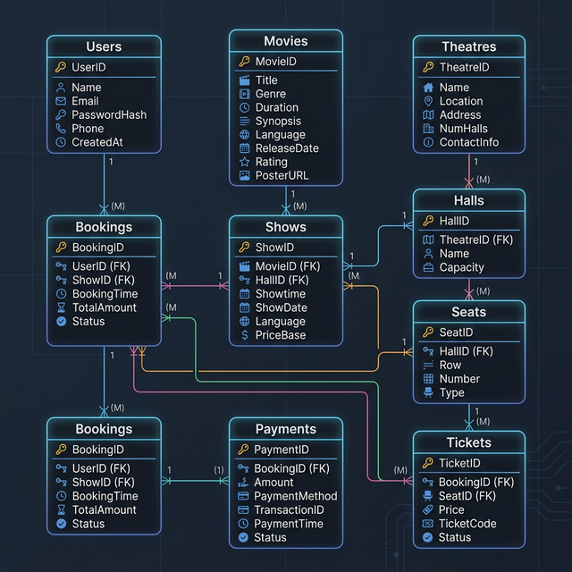
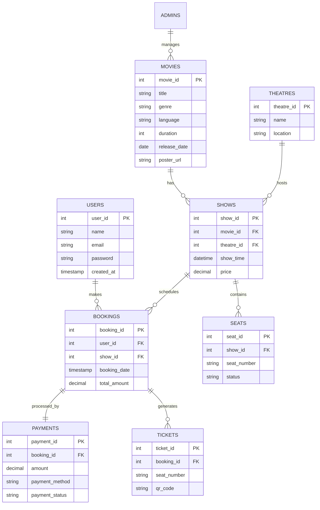

# BookMyShow Backend API

This is the backend service for the BookMyShow application, built with Node.js, Express, and MongoDB. It handles movie management, theatre scheduling, seat bookings, and user authentication.

## 🚀 Features

- **Authentication & Authorization**: Secure login for both Users and Admins using JWT and Bcrypt hashing.
- **Movie Management**: Complete CRUD operations for movies, including poster uploads.
- **Show Scheduling**: Manage movie shows across different theatres with specific timings and pricing.
- **Seat Booking System**: Real-time tracking of seat availability (Available vs. Booked).
- **Payment Processing**: Mock payment integration with status tracking.
- **Ticket Generation**: Automated ticket generation with QR code support.

---

## 📊 Database Architecture

### Entity Relationship (ER) Diagram





### 🛠 Schema Normalization

The database adheres to **Third Normal Form (3NF)** to ensure data integrity and reduce redundancy:

1.  **First Normal Form (1NF)**: All tables have a primary key, and each column contains atomic values. No repeating groups exist (e.g., individual `seat_number` entries in `tickets` and `seats`).
2.  **Second Normal Form (2NF)**: All non-key attributes are fully functionally dependent on the primary key. For instance, in the `SHOWS` table, `show_time` and `price` depend entirely on `show_id`.
3.  **Third Normal Form (3NF)**: There are no transitive dependencies. For example, `theatre_name` and `location` are kept in the `THEATRES` table rather than being repeated in the `SHOWS` table.

### 🔗 SQL Join Operations

The application leverages complex SQL Joins to aggregate data across multiple tables.

**Example: Fetching Booking Details**
To show a user their booking history, we perform a 4-way join:
```sql
SELECT bookings.*, shows.show_time, movies.title, theatres.name
FROM bookings
JOIN shows ON bookings.show_id = shows.show_id
JOIN movies ON shows.movie_id = movies.movie_id
JOIN theatres ON shows.theatre_id = theatres.theatre_id
WHERE bookings.user_id = ?;
```

---

## 🛠 Tech Stack

- **Runtime**: Node.js
- **Framework**: Express.js
- **Database**: MongoDB
- **Auth**: JSON Web Tokens (JWT), Bcrypt.js
- **File Uploads**: Multer
- **QR Codes**: qrcode

---

## 🛠 Setup Instructions

### 1. Prerequisites
- Node.js installed
- MongoDB running (local or Atlas)

### 2. Database Configuration
Set your MongoDB connection string in the environment variables (see below).

### 3. Installation
```bash
cd backend
npm install
```

### 4. Environment Variables
Create a `.env` file in the `backend` root and add your configurations (refer to `db.js` for parameters):
```env
MONGO_URI=mongodb://localhost:27017/movie_booking_db
JWT_SECRET=your_jwt_secret_key
```

### 5. Start Server
```bash
npm start
```

---

## 🛣 API Endpoints (Quick Reference)

| Category | Endpoint | Method | Description |
| :--- | :--- | :--- | :--- |
| **Auth** | `/api/auth/register` | POST | Register a new user |
| | `/api/auth/login` | POST | User login |
| **Movies** | `/api/movies` | GET | Get all movies |
| | `/api/movies` | POST | Add a movie (Admin) |
| **Shows** | `/api/shows` | GET | List all shows |
| **Bookings**| `/api/bookings` | POST | Create a booking |
| | `/api/bookings/user/:id` | GET | Get user booking history |
| **Seats** | `/api/seats/:showId` | GET | Get seat layout for a show |

---
